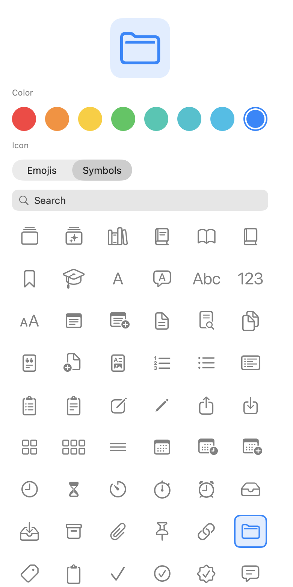
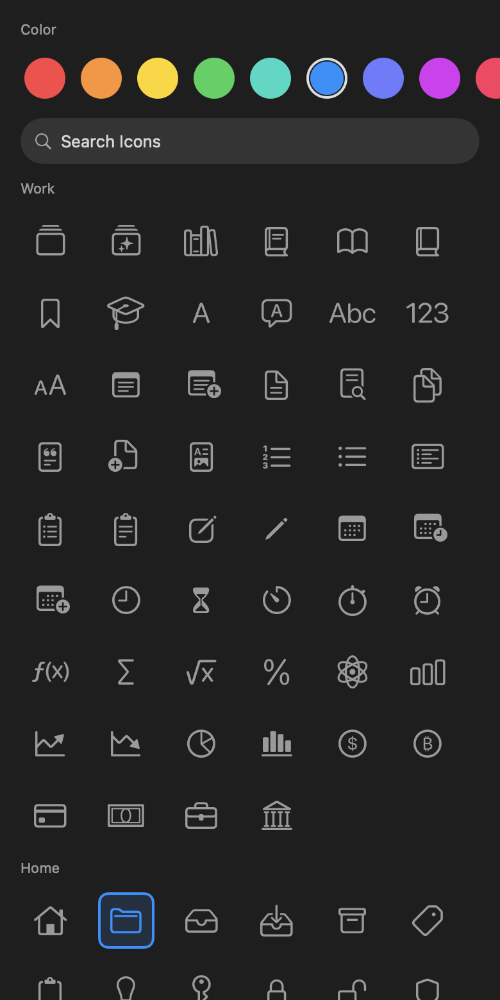
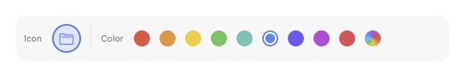
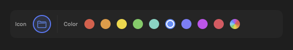
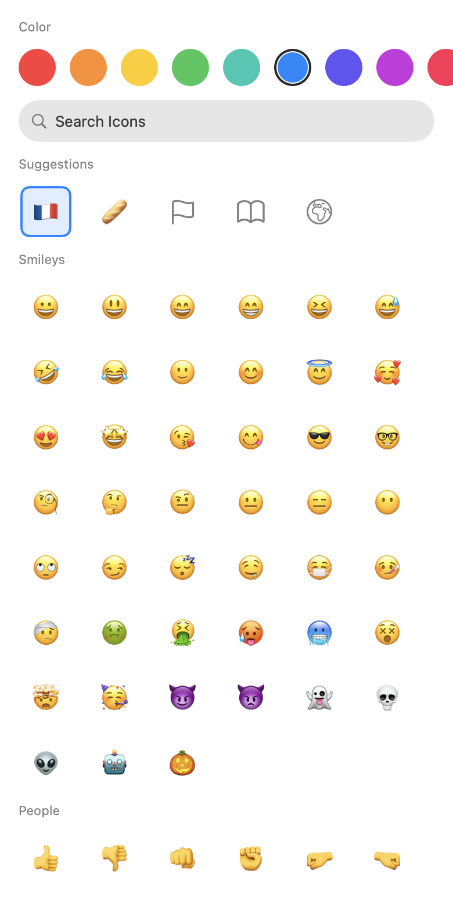
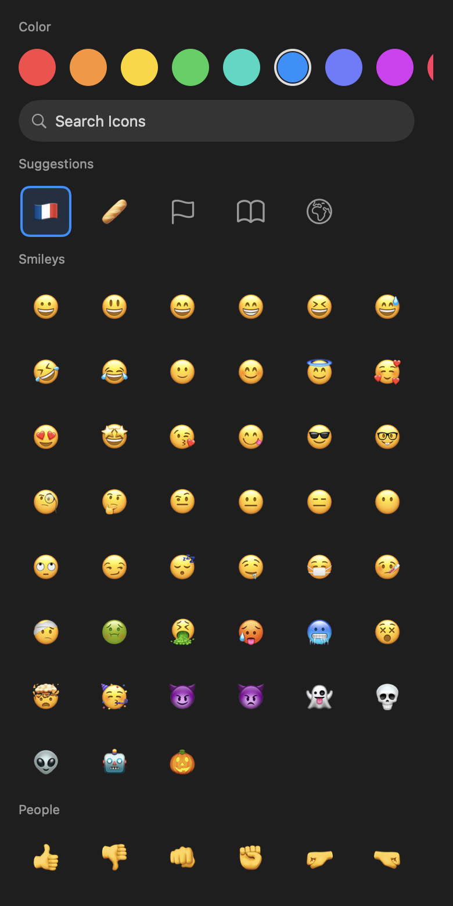

# IconPickerKit

A SwiftUI picker for a tint color plus an emoji or SF Symbol. Bind two values the consumer owns.

- `IconPickerView` — a full picker for an iPhone or iPad sheet or pushed screen.
- `IconPickerRow` — compact swatches and one catalog popover for a form. On Mac, embed this in the form. Do not present `IconPickerView` in a sheet.

## Preview

<p>
  
  
</p>

`IconPickerView`. Present it in a sheet; you own Done.

<p>
  
  
</p>

`IconPickerRow` in a form.

## Requirements

- iOS 26+ / macOS 26+
- Swift 6.2+

## Installation

Internal to the `hksw-io` org. Add:

```swift
.package(url: "https://github.com/hksw-io/iconpickerkit.git", from: "1.0.0")
```

```swift
.product(name: "IconPickerKit", package: "IconPickerKit"),
```

In Xcode: **File > Add Package Dependencies…** and enter the URL above. You need access to the org.

## Usage

On iPhone and iPad, present `IconPickerView` in a sheet. Bindings update live; you own dismissal. On Mac, skip the sheet and put `IconPickerRow` in the form instead.

```swift
import SwiftUI
import IconPickerKit

struct EditItemView: View {
    @State private var icon = "folder"
    @State private var color = IconPickerColor.blue
    @State private var showingPicker = false

    var body: some View {
        Button("Icon") { self.showingPicker = true }
            .sheet(isPresented: self.$showingPicker) {
                NavigationStack {
                    IconPickerView(icon: self.$icon, color: self.$color)
                        .navigationTitle("Icon")
                        .toolbar {
                            ToolbarItem(placement: .confirmationAction) {
                                Button("Done") { self.showingPicker = false }
                            }
                        }
                }
            }
    }
}
```

`icon` is either an emoji (`"🐶"`) or an SF Symbol name (`"folder"`). Persist `icon` and `color.id`.

One mixed catalog, grouped by meaning (People, Work, Home, …). Search Icons filters the whole library. Keystrokes debounce for 250 ms.

Presets set which groups appear, their order, and how many items each shows:

```swift
IconPickerView(icon: $icon, color: $color, catalog: .compact)
```

`.all` is every group, uncapped. `.compact` and `.work` cap each section. Or build your own — Smileys last, 8 each:

```swift
IconPickerView(
    icon: $icon,
    color: $color,
    catalog: IconCatalogPreset(
        groups: IconGroup.allCases.filter { $0 != .smileys } + [.smileys],
        limit: 8))
```

### Suggested icons

Pass a `hint` — a deck name, title, or other short label. When Apple's on-device Foundation Model is available it may return emoji or SF Symbol names (a deck called `"French"` can surface 🇫🇷). Those appear as a Suggestions group at the top of the catalog. If the model is off, unavailable, or returns nothing usable, the extra group is omitted. No API key.

```swift
IconPickerView(icon: $icon, color: $color, hint: deckName)
```

Start the work before presenting the sheet so the group can already be there:

```swift
let suggestions = IconSuggestions.preload(hint: deckName)

.sheet(isPresented: $showingPicker) {
    IconPickerView(icon: $icon, color: $color, suggestions: suggestions)
}
```

Or await a finished result and pass that — the extra group is on the first frame:

```swift
let suggestions = await IconSuggestions.load(hint: deckName)
IconPickerView(icon: $icon, color: $color, suggestions: suggestions)
```

<p>
  
  
</p>

### On Mac

Embed the compact row in the form. A full-picker sheet is the iPhone layout.

```swift
Form {
    IconPickerRow(icon: self.$icon, color: self.$color)
}
.formStyle(.grouped)
```

### Palette, symbols, and labels

```swift
let brand = IconPickerColor(id: "brand", name: "Brand", color: .indigo)

IconPickerView(
    icon: self.$icon,
    color: self.$color,
    colors: [.blue, brand],
    allowsCustomColor: true,
    symbols: ["folder", "star", "heart"],
    labels: IconPickerLabels(
        color: String(localized: "picker.color"),
        icon: String(localized: "picker.icon"),
        emojis: String(localized: "picker.emojis"),
        symbols: String(localized: "picker.symbols"),
        search: String(localized: "picker.search")))
```

`IconPickerRow` takes the same `colors`, `symbols`, and `labels` arguments.

Search and classification are also public if you want the catalogs without the view:

```swift
let hits = EmojiCatalog.search("dog")
let kind = IconKind.classify("🐶")  // .emoji
```

## Local development

```sh
swift test
swift run GenerateMedia
```

`GenerateMedia` rewrites the README stills in `Docs/Media`.

## License

MIT. See [LICENSE](LICENSE).
